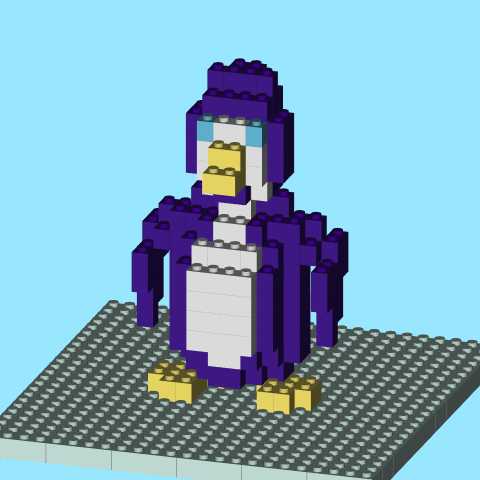
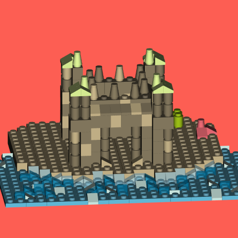

LEGO Mosaics in R
================

# brickr Toy Box 

<!--   <!-- badges: start -->

[](https://CRAN.R-project.org/package=brickr)
[](https://cran.r-project.org/package=brickr)
[](https://www.tidyverse.org/lifecycle/#experimental)
[](https://travis-ci.org/ryantimpe/brickr)
<!--   <!-- badges: end -->

## Overview

**brickr** is a package for bringing the LEGO® experience into the R and
[tidyverse](https://www.tidyverse.org/) ecosystem.

The package is divided into 2 systems:

  - [**Mosaics**](#mosaics): Convert image files into mosaics that could
    be built using LEGO bricks.
  - [**3D Models**](#3d-models): Build 3D LEGO models from data tables
    using [rgl](https://CRAN.R-project.org/package=rgl).

brickr also includes tools help users create the Mosaics and 3D model
output using real LEGO elements.

Check out [brickr.org](http://brickr.org) for more detail\!

### What’s the point?

The goal of **brickr** is to provide a series of tools to integrate the
LEGO system with R by:

  - Enhancing a real world building experience with mosaics, generated
    instructions, and piece counts.
  - Generating interest in R and coding for new audiences with
    easy-to-create 3D models.
  - Embracing pure novelty.

*brickr is developed under the [Fair
Play](https://www.lego.com/en-us/legal/notices-and-policies/fair-play/)
policy using publicly available information about LEGO products. brickr
is not affiliated with The LEGO Group.*

## Installation

``` r
# Install from CRAN
install.packages("brickr")

# To install the latest development version from Github:
# install.packages("remotes")
remotes::install_github("ryantimpe/brickr")
```

## Starter Kit


The Excel file “brickr\_StartKit.xlsx” provides templates, as well as a
How-To manual and examples, for laying out models in Excel and then
rendering them as 3D models in R using brickr.

  - Lay out a model and the color key in Excel using one of the template
    or examples provided in the file.
  - Import the Excel sheet into R as a data frame using [Jenny
    Bryan](https://twitter.com/JennyBryan)’s
    [readxl](https://readxl.tidyverse.org/) package.
  - Convert this data frame into a brickr object using
    `bricks_from_excel()`.

<!-- -->

``` r
penguin <- readxl::read_xlsx("brickr_StarterKit.xlsx", sheet = "Penguin")

penguin %>% 
  bricks_from_excel() %>% 
  build_bricks(background_color = "#99e7ff")

#Rotate the default view for a better snapshot
rgl::par3d(userMatrix = rgl::rotate3d(rgl::par3d("userMatrix"), 0.9*pi, 0, 0 ,1),
           zoom = 0.7)
```

<!-- -->

## Advanced models

The penguin model is made completely of standard LEGO bricks placed at
regularly heights. Once comfortable with building these simple models,
you can build more advanced models with two additional features.

  - Include a 2nd table in the `piece_table` argument to tell R to
    render certain bricks as different shapes. See [this
    vignette](http://brickr.org/articles/models-piece-type.html) for
    more information about shapes.

  - Add a `mid_level` column to the right of `Level` in the Excel tables
    to place bricks in between levels. Without this, all bricks are
    placed on mid\_level = 0, which is the bottom of the Level. Use
    mid\_level=1 for the middle of the Level, and mid\_level = 2 for the
    top. This is valuable when using other piece shapes, such as plate,
    which are 1/3 as tall as a brick.

<!-- end list -->

``` r
sandcastle_colors <- readxl::read_xlsx("brickr_StarterKit.xlsx", 
                                      sheet = "SandCastle_colors")

sandcastle_bricks <- readxl::read_xlsx("brickr_StarterKit.xlsx", 
                                      sheet = "SandCastle_bricks")

sandcastle_colors %>% 
  bricks_from_excel(
    piece_table = sandcastle_bricks,
  ) %>% 
  build_bricks(background_color = "#fd5e53")

#Rotate the default view for a better snapshot
rgl::par3d(userMatrix = rgl::rotate3d(rgl::par3d("userMatrix"), 0.1, 0, 0 ,1),
           zoom = 0.7)
```

<!-- -->

## Contribute

Please feel free to contribute your own examples into any of the
“Examples\_” folders by submitting a pull request\!

## Other Examples

More examples using `bricks_from_table()` and `bricks_from_coords()` can
be found at the links below.

  - [**Baby
    Yoda**](https://gist.github.com/ryantimpe/3893fdd0f94138d027bae35bf38b57c7)
    example using `bricks_from_excel()` with an animation.
  - [**brickr 0.3 release
    video**](https://gist.github.com/ryantimpe/b685caaa7f6c001a9a227f48bf9a5852)
    with a static model and `bricks_from_excel()`.
